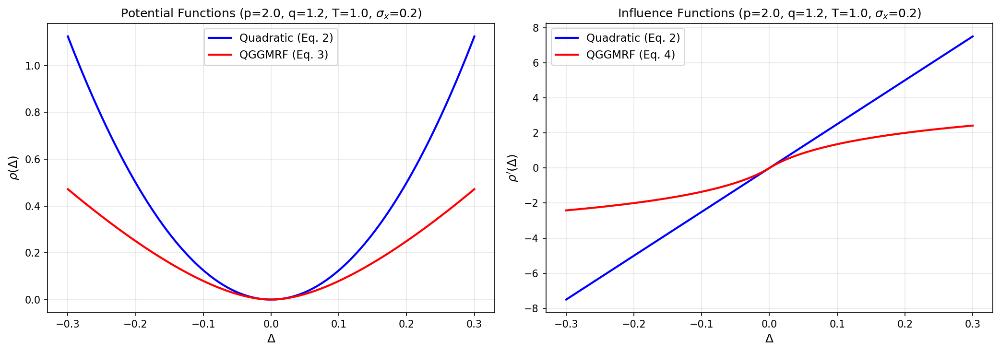
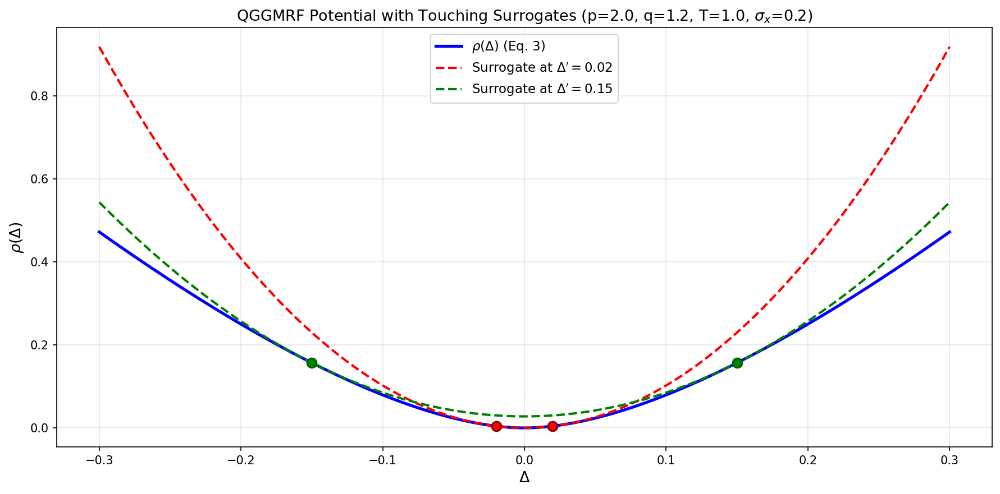
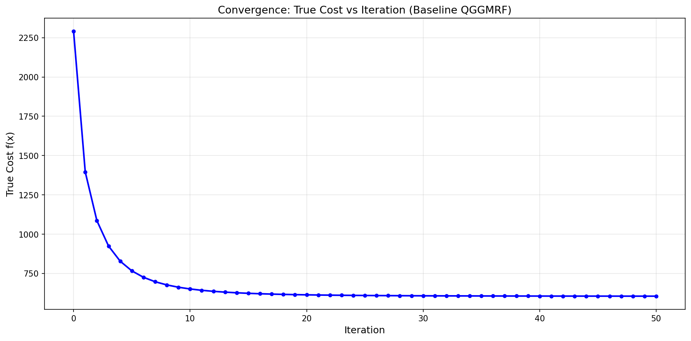
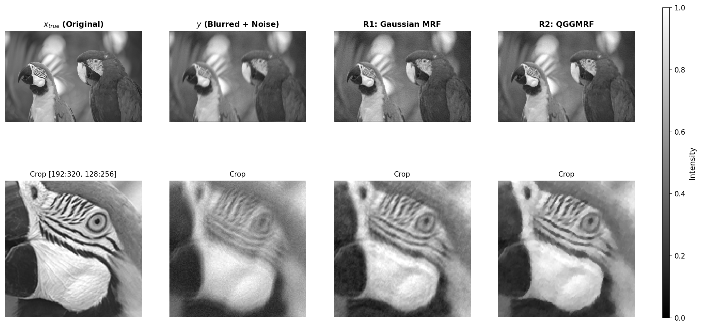
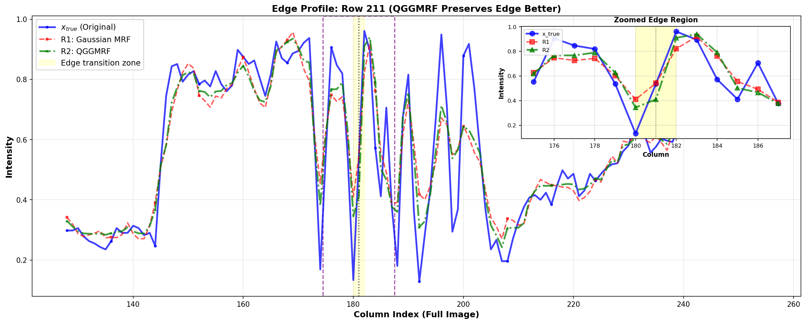
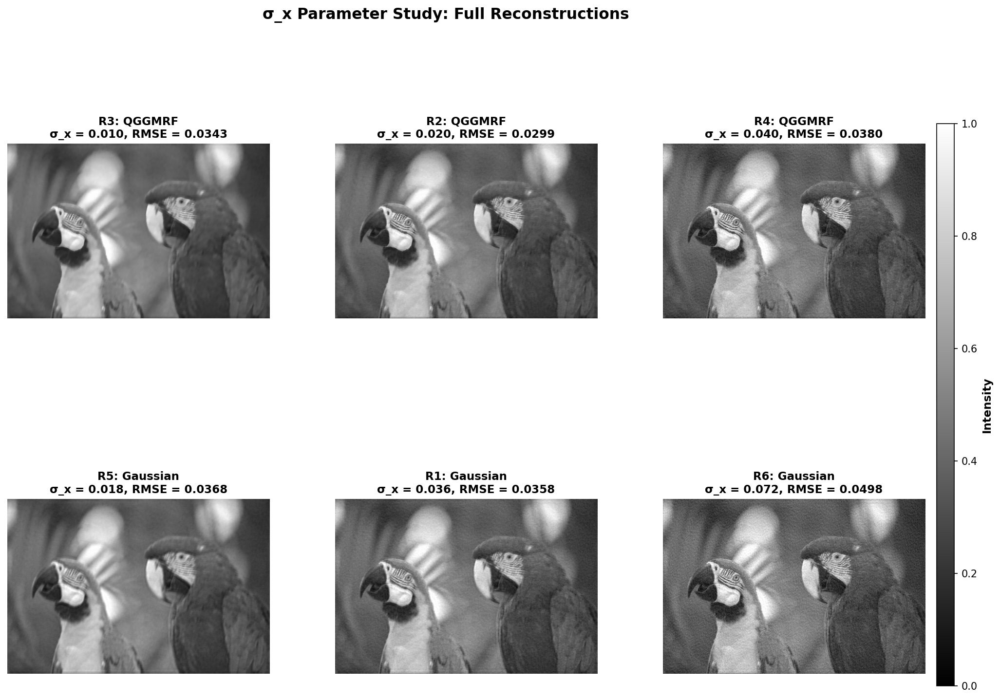
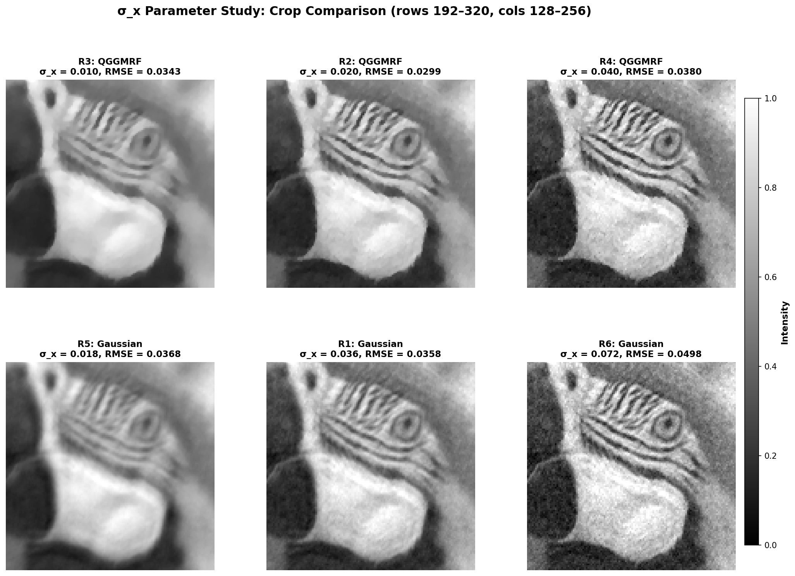
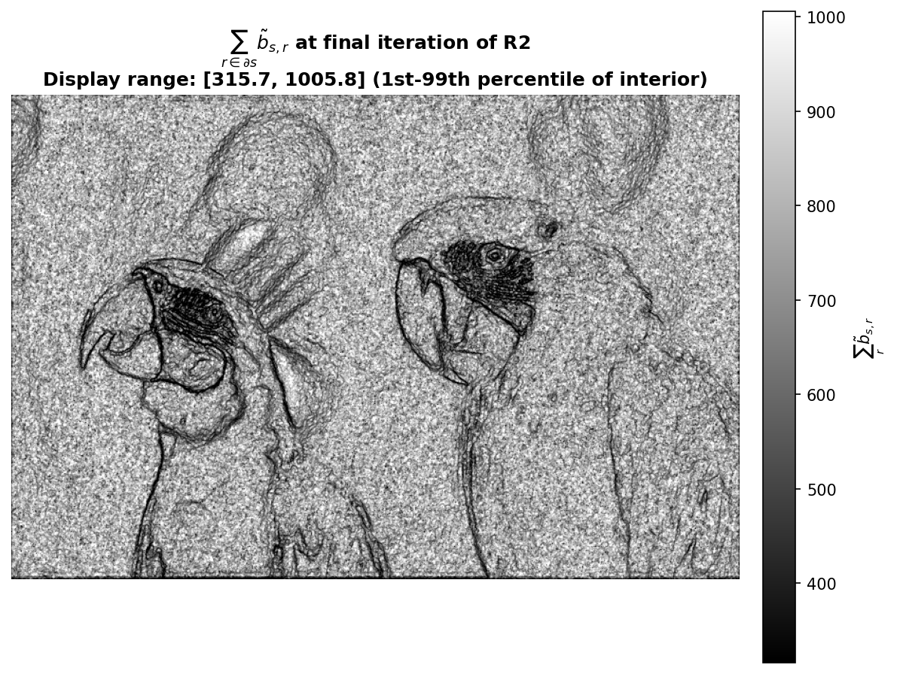

# Lab 4: MAP Reconstruction with Non-Gaussian Priors

## Deliverable 1 (D1): Potential and Influence Function Comparison

### Interpretation

The QGGMRF potential behaves like a quadratic potential for small differences, as both panels show the two curves coinciding for Δ ∈ [-0.05, 0.05]. For larger |Δ|, the quadratic potential's influence increases linearly, whereas the QGGMRF influence flattens out, allowing QGGMRF to suppress noise in flat regions while preserving edges.

## Deliverable 2 (D2): Limiting Value of b̃_{s,r} at Δ' = 0

For the general QGGMRF coefficient:

$$\tilde{b}_{s,r} = b_{s,r}\,\frac{|\Delta'|^{p - 2}}{2\sigma_{x}^{p}}\;\frac{\left| \frac{\Delta'}{T\sigma_{x}} \right|^{q - p}\left( \frac{q}{p} + \left| \frac{\Delta'}{T\sigma_{x}} \right|^{q - p} \right)}{\left( 1 + \left| \frac{\Delta'}{T\sigma_{x}} \right|^{q - p} \right)^{2}}$$

We derive the limiting value when $\Delta' \to 0$ for the general case $q < p$. Let $d = \left|\frac{\Delta'}{T\sigma_{x}}\right|$. Then the fraction becomes:

$$F(d) = \frac{d^{q-p} \left( \frac{q}{p} + d^{q-p} \right)}{\left(1 + d^{q-p}\right)^2}$$

For $q < p$, we have $q - p < 0$. Substituting $u = d^{q-p}$, so as $d \to 0$ we have $u \to \infty$, the fraction becomes:

$$F(u) = \frac{u\left(\frac{q}{p} + u\right)}{(1 + u)^2} = \frac{\frac{q}{p}u + u^2}{1 + 2u + u^2}$$

As $u \to \infty$, both numerator and denominator are $O(u^2)$: the numerator is dominated by $u^2$ and the denominator by $u^2$, so both diverge to infinity. Applying L'Hôpital's rule as $u \to \infty$:

$$\lim_{u \to \infty} \frac{\frac{q}{p}u + u^2}{1 + 2u + u^2} = \lim_{u \to \infty} \frac{\frac{d}{du}\left(\frac{q}{p}u + u^2\right)}{\frac{d}{du}(1 + 2u + u^2)} = \lim_{u \to \infty} \frac{\frac{q}{p} + 2u}{2 + 2u}$$

This is still $\infty/\infty$, so applying L'Hôpital's rule again:

$$= \lim_{u \to \infty} \frac{\frac{d}{du}\left(\frac{q}{p} + 2u\right)}{\frac{d}{du}(2 + 2u)} = \lim_{u \to \infty} \frac{2}{2} = 1$$

Therefore, with $p = 2$ and $|\Delta'|^0 = 1$:

$$\tilde{b}_{s,r} \to b_{s,r}\,\frac{1}{2\sigma_x^2}$$

## Deliverable 3 (D3): QGGMRF Potential with Touching Surrogates

Each surrogate function touches the potential at both marked points $\Delta = \pm\Delta'$ and lies strictly above the potential everywhere else, confirming that the surrogates form valid majorizers for the optimization algorithm.

## Deliverable 4 (D4): Implementation Log

### neighbor_diffs
**Prompt:** "Implement neighbor_diffs. Since no pixel loops are allowed, use vectorized torch functions, such as functions equivalent to np.roll. Make sure the appropriate zero columns/rows appear for the correct shift directions."

**Potential issue:** `torch.roll()` performs circular/periodic boundary wrapping by default, which is incorrect for image boundaries; the validity mask must explicitly mark these wrapped regions as invalid.

### surrogate_weights
**Prompt:** "Implement surrogate_weights, which are the coefficients to $b_{s,r}$. Equation (14) is general, while equation (15) only works for $p = 2$, and vanishingly small neighbor_diffs. Make sure it can be elementwise-multiplied with neighbor_diff outputs. The two equations are proven in lab4_report.md"

**Potential issue:** Equation (15) is only the $\Delta' \to 0$ limit of equation (14). It must not be applied to every pair just because $p = 2$: for $q < p$ the QGGMRF factor still depends on $|\Delta'|$, so the weights must stay edge-dependent. The initial implementation made this mistake and produced a flat D9 image. The fixed version uses equation (14) everywhere and floors $|\Delta'|$ at 1e-8, where the factor is already ≈ 1, to avoid the diverging exponent at $\Delta' = 0$.

### true_cost
**Prompt:** "Implement true_cost. Modify the docstring"

**Potential issue:** The validity mask must be applied *after* computing $\rho$ to ensure floored border pairs contribute exactly zero (not NaN or undefined values).

### true_gradient
**Prompt:** "Implement true_gradient. Correct the docstring"

**Potential issue:** If $x$ is passed without `requires_grad=True`, the gradient computation fails silently or raises an error.

### optimal_step_size
**Prompt:** "Implement optimal_step_size. Correct the docstring"

**Potential issue:** Must ensure that `forward()` and `neighbor_diffs()` are applied to the gradient $g$, not the image $x$.

### reconstruct
**Prompt:** "Implement reconstruct. Keep the docstring"

**Potential issue:** Must keep `requires_grad=True` on $x$ throughout to enable gradient computation in `true_gradient()`, but must `.detach()` when passing to `optimal_step_size()` to avoid unnecessary graph overhead.

## Deliverable 5 (D5): Convergence Verification

The true cost decreased monotonically at every iteration (1684.57 total decrease over 50 iterations, final cost 605.58), confirming that the surrogate weight formula (equation 14 for every pair, with equation 15 as its Δ' → 0 limit) and optimal step size computation are correct.

*Correction:* an earlier version of `surrogate_weights` applied the equation (15) limit to every pair whenever p = 2. That is still a valid majorizer, so the cost still decreased monotonically, but it is loose and inconsistent with the surrogate for QGGMRF. It was fixed to use equation (14) everywhere, and D5-D10 were regenerated.

## Deliverable 6 (D6): Image Reconstruction Comparison

Comparison of original, blurred, and reconstructed images using Gaussian MRF (R1: σ_x=0.036, T=100) and QGGMRF (R2: σ_x=0.020, T=1). The 128×128 crop is extracted from rows 192–320, columns 128–256, showing a sharp high-contrast edge region. Both reconstructions have reduced blur compared to the observation y, but using QGGMRF as a prior has seen better edge preservation quality.

## Deliverable 7 (D7): Edge Profile Plot

Horizontal line profile across a strong edge in the crop region, comparing the pixel intensities of x_true (original), R1 (Gaussian MRF), and R2 (QGGMRF). The plot shows how each reconstruction preserves or smooths the sharp edge transition, with R2 preserving sharper transitions due to the QGGMRF edge-preserving prior, while R1 displaying stronger smoothing and therefore destroying edge contrast due to the quadratic prior.

## Deliverable 8 (D8): σ_x Parameter Sensitivity Study

### Full Reconstructions

### Cropped Reconstructions

Across σ_x at half, centre and double, small values blur or flatten the image and large values leave it noisy, and QGGMRF keeps edges better than the Gaussian prior, with R2 (σ_x = 0.020, RMSE 0.0299) the best of the six.

## Deliverable 9 (D9): Surrogate Weight Sum Image

The image shows $\sum_{r \in \partial s} \tilde{b}_{s,r}$ (the 8 neighbor planes of `surrogate_weights` summed per pixel) at the final iteration of R2. It is displayed in grayscale over **[315.7, 1005.8]**, the 1st-99th percentile of the interior, so the one-pixel border (fewer valid neighbors) does not stretch the scale. The full interior range is [92.0, 1155.0] (standard deviation 143.3); the border rows and columns reach down to 87.8.

Flat regions are bright, close to the Δ' → 0 limit $\sum_r b_{s,r} / (2\sigma_x^2) = 1250$. Along edges, pixel pairs with $|\Delta'| > T\sigma_x = 0.02$ (about 19% of interior pairs) are down-weighted by the QGGMRF factor, so the beak, the eye, the feather outlines and the head contours appear as dark lines. These are the pixels where the surrogate prior curvature is small, which is how QGGMRF avoids smoothing across edges.

## Deliverable 10 (D10): Reconstruction Metrics Summary

| Run | Prior | σ_x | RMSE (vs x_true, [0,1]) | Wall clock (s) |
|-----|-------|------|--------------------------|----------------|
| R1 | Gaussian | 0.036 | 0.035754 | 65.17 |
| R2 | QGGMRF | 0.020 | 0.029885 | 64.76 |
| R3 | QGGMRF | 0.010 | 0.034329 | 64.29 |
| R4 | QGGMRF | 0.040 | 0.037991 | 64.48 |
| R5 | Gaussian | 0.018 | 0.036785 | 64.67 |
| R6 | Gaussian | 0.072 | 0.049791 | 63.49 |

All six runs use N = 50 iterations and ω = 1, and were timed one at a time on an otherwise idle machine. RMSE is computed on the unclamped reconstruction.

## Deliverable 11 (D11):

1. Comparing the R1 Gaussian MRF and R2 QGGMRF crops and the edge profile, I found that in the flat regions, there is not substantial difference between the two. This is because when neighboring pixel-wise differences $|\Delta| = |x_s -x_r|$ are small, the two priors coincide with each other, as seen in Deliverable 1. However, across a sharp edge, R2 QGGMRF preserves that edge contrast better than R1 Gaussian MRF. This is supported by Deliverable 1, where we saw that the influence function of QGGMRF does not penalize high-contrast pixel pairs as severely as that of Gaussian MRF does.

2. No. As an example, I preferred the images that have higher contrast, such as R4, but it has a higher RMSE than R5. RMSE is quadratic, it penalizes high-error data points. Therefore, it will trade a few high-error pixels for many low-error pixels, therefore biasing towards low-contrast images. 

3. $\sigma_x$ controls how strong the regularization is, or what is assumed to be the strength of the Gaussian white noise in the forward model. At small $\sigma_x$, the noise power of the prior is strong, and therefore the image is regularized more strongly, creating a smoother yet flatter image. At large $\sigma_x$, the noise power of the prior is assumed to be weak, and therefore the image is regularized less strongly. The resulting images are noisier but retains high-frequency details better.

4. From D1, we saw that QGGMRF does not penalize large differences as severely as Gaussian MRF does. This means for that regime, we can decrease $\sigma_x$ (i.e., a stronger regularization) compared to Gaussian MRF without paying a price in over-smoothing edges. Since we have more margin in increasing the regularization power, over at flat regions, we see a better smoothing result. 

5. We recall that for small inter-pixel differences, i.e., $|\Delta| \ll T \sigma_x$, we have $\rho(\Delta) \approx |\Delta|^p / (p \sigma_x^p)$. Without loss of generality we assume $\Delta \geq 0$, and we take the second-derivative in $\Delta$,

$$
\rho''(\Delta) \approx \frac{d^2}{d \Delta^2} \frac{\Delta^p}{p \sigma_x^p} = \frac{p(p-1)\Delta^{p-2}}{p \sigma_x^p} = \frac{(p-1)\Delta^{p-2}}{\sigma_x^p}.
$$

We see that if we take $\Delta \rightarrow 0^+$ we have a diverging $\rho''$ if $p < 2$. 

6. The true cost is monotonically decreasing. In Equation (8), we showed that the surrogate must be monotonically decreasing upon gradient descent. Therefore, we showed that our true cost should also be monotonically decreasing. This is demonstrated in Deliverable 5.

If the $\overset{\sim}{b}$ formula came out slightly too small, then we might not have the upper bound relationship $f(x) \leq q(x; x')$ for all $x$. Then Equation (8) might not stand. Then we might not have a monotonically decreasing relationship between the surrogate and the true cost.

7. From D9, we see the edges and neighborhoods of high contrast visualized. Importantly, neighbors of high contrast have lower values. This means they are weighed less in order to preserve their contrast. 
